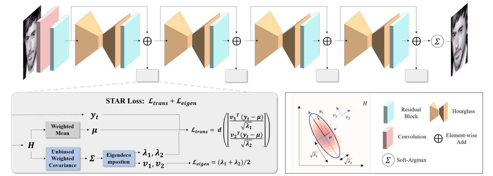
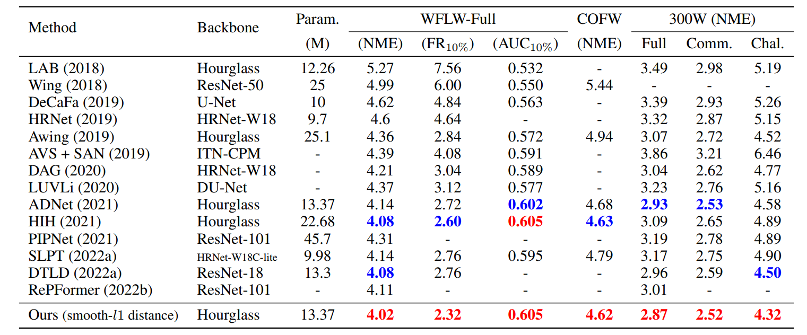

# STAR Loss: Reducing Semantic Ambiguity in Facial Landmark Detection.

Paper Link: [arxiv](https://arxiv.org/abs/2306.02763) | [CVPR 2023](https://openaccess.thecvf.com/content/CVPR2023/papers/Zhou_STAR_Loss_Reducing_Semantic_Ambiguity_in_Facial_Landmark_Detection_CVPR_2023_paper.pdf) 


- Pytorch implementation of **S**elf-adap**T**ive **A**mbiguity **R**eduction (**STAR**) loss.
- STAR loss is a self-adaptive anisotropic direction loss, which can be used in heatmap regression-based methods for facial landmark detection.
- Specifically, we find that semantic ambiguity results in the anisotropic predicted distribution, which inspires us to use predicted distribution to represent semantic ambiguity. So, we use PCA to indicate the character of the predicted distribution and indirectly formulate the direction and intensity of semantic ambiguity. Based on this, STAR loss adaptively suppresses the prediction error in the ambiguity direction to mitigate the impact of ambiguity annotation in training. More details can be found in our paper.
<p align="center">
    
</p>


## Dependencies

Install dependencies for python 3.7 using:

* pip install -r requirements-py37.txt

Install dependencies for python 3.10 using:

* pip install -r requirements-py310.txt

You may need to install a different pytorch build, depending on your GPU support in CUDA https://pytorch.org/get-started/previous-versions/

## Dataset Preparation

 - Step1: Download the raw images from [COFW](http://www.vision.caltech.edu/xpburgos/ICCV13/#dataset), [300W](https://ibug.doc.ic.ac.uk/resources/300-W/), and [WFLW](https://wywu.github.io/projects/LAB/WFLW.html).
 - Step2: We follow the data preprocess in [ADNet](https://openaccess.thecvf.com/content/ICCV2021/papers/Huang_ADNet_Leveraging_Error-Bias_Towards_Normal_Direction_in_Face_Alignment_ICCV_2021_paper.pdf), and the metadata can be download from [the corresponding repository](https://github.com/huangyangyu/ADNet).
 - Step3: Make them look like this:
```script
# the dataset directory:
|-- ${image_dir}
   |-- WFLW
      | -- WFLW_images
   |-- 300W
      | -- afw
      | -- helen
      | -- ibug
      | -- lfpw
   |-- COFW
      | -- train
      | -- test
|-- ${annot_dir}
   |-- WFLW
      |-- train.tsv, test.tsv
   |-- 300W
      |-- train.tsv, test.tsv
   |--COFW
      |-- train.tsv, test.tsv
```

## Usage
* Work directory: set the ${ckpt_dir} in ./conf/alignment.py.
* Pretrained model: 

| Dataset                                                          | Model                                                                                                                                                               |
|:-----------------------------------------------------------------|:--------------------------------------------------------------------------------------------------------------------------------------------------------------------|
| WFLW                                                             | [google](https://drive.google.com/file/d/1aOx0wYEZUfBndYy_8IYszLPG_D2fhxrT/view?usp=sharing) / [baidu](https://pan.baidu.com/s/10vvI-ovs3x9NrdmpnXK6sg?pwd=u0yu)    |
| 300W                                                             | [google](https://drive.google.com/file/d/1NFcZ9jzql_jnn3ulaSzUlyhS05HWB9n_/view?usp=sharing) / [baidu](https://pan.baidu.com/s/1bjUhLq1zS1XSl1nX78fU7A?pwd=yb2s)    |
| COFW                                                             | [google](https://drive.google.com/file/d/1Fiu3hjjkQRdKsWE9IgyNPdiJSz9_MzA5/view?usp=sharing) / [baidu](https://pan.baidu.com/s/1XO6hDZ8siJLTgFcpyu1Tzw?pwd=m57n) |


### Training
```shell
python main.py --mode=train --device_ids=0,1,2,3 \
               --image_dir=${image_dir} --annot_dir=${annot_dir} \
               --data_definition={WFLW, 300W, COFW} \
               --ckpt_dir=${out_dir} 
```

The batch_size parameter may need to be set depending on available GPU memory. e.g "--batch_size=16"

### Testing
```shell
python main.py --mode=test --device_ids=0 \
               --image_dir=${image_dir} --annot_dir=${annot_dir} \
               --data_definition={WFLW, 300W, COFW} \
               --pretrained_weight=${model_path} \
               --ckpt_dir=${out_dir} 
```

### Evaluation
```shell
python evaluate.py --device_ids=0 \
                   --model_path=${model_path} --metadata_path=${metadata_path} \
                   --image_dir=${image_dir} --data_definition={WFLW, 300W, COFW} \ 
                   --ckpt_dir=${out_dir} 
```

To test on your own image, the following code could be considered:
```shell
python demo.py
```


## Results
The models trained by STAR Loss achieved **SOTA** performance in all of COFW, 300W and WFLW datasets.

<p align="center">
    
</p>

## BibTeX Citation
Please consider citing our papers in your publications if the project helps your research. BibTeX reference is as follows.
```
@inproceedings{Zhou_2023_CVPR,
    author    = {Zhou, Zhenglin and Li, Huaxia and Liu, Hong and Wang, Nanyang and Yu, Gang and Ji, Rongrong},
    title     = {STAR Loss: Reducing Semantic Ambiguity in Facial Landmark Detection},
    booktitle = {Proceedings of the IEEE/CVF Conference on Computer Vision and Pattern Recognition (CVPR)},
    month     = {June},
    year      = {2023},
    pages     = {15475-15484}
}
```

## Acknowledgments
This repository is built on top of [ADNet](https://github.com/huangyangyu/ADNet). 
Thanks for this strong baseline.
